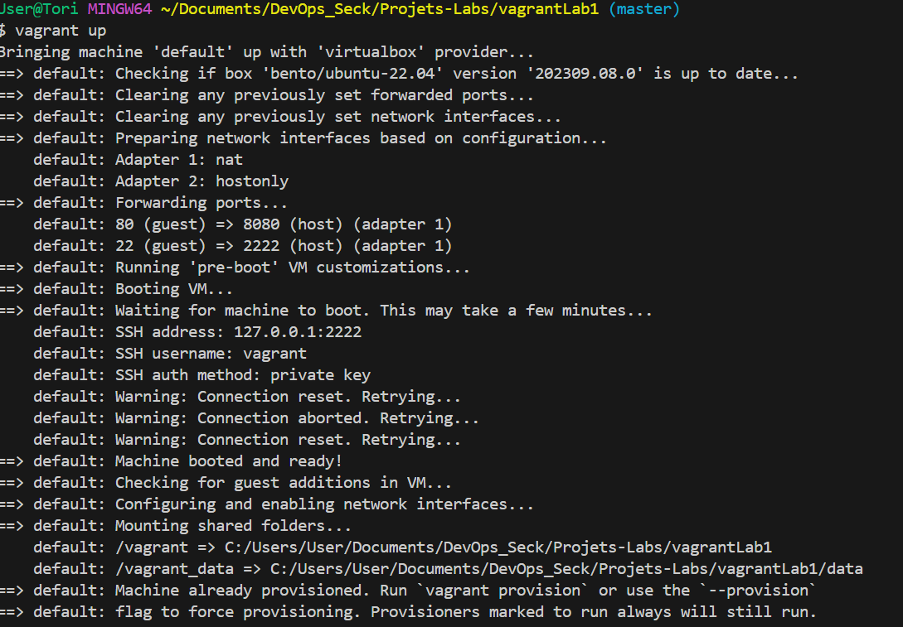
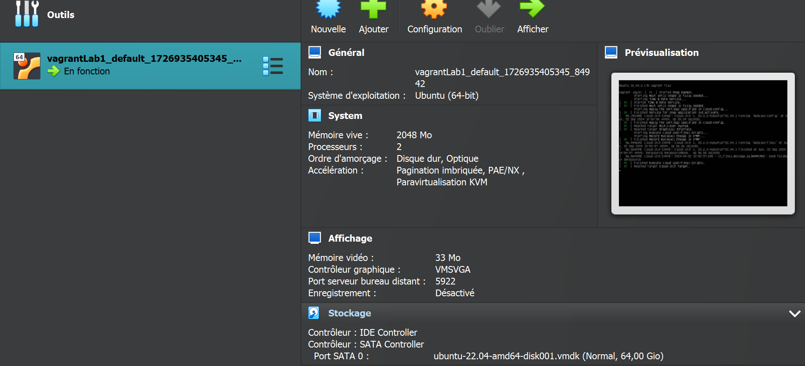

# Lab 1 avec 

## Créer un repository github nommé vagrantLab1
## Créer un projet en local sur votre machine
 
## Lancer vagrant init pour initialiser vagrantfile

##  Créer une machine virtelle ubuntu avec les spécifications suivantes :
##  4.1 Box : bento/ubuntu-22.04
##  4.2 ip : 192.168.13.6, 
##  4.3 forwarded_port pour guest: 80 et host: 80, 
##  4.4 synced_folder pour partager un repertoire de votre VM 

# Run vagrant with vagrant up

# Virtualbox VM runing
